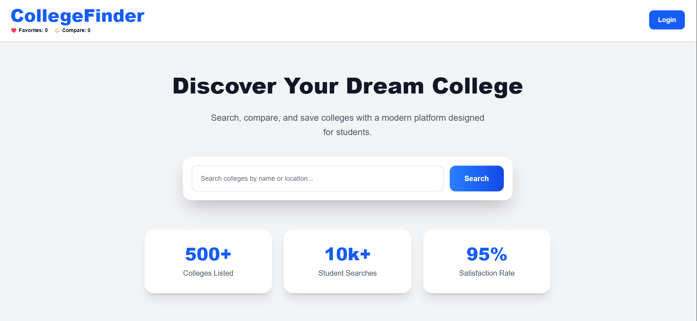
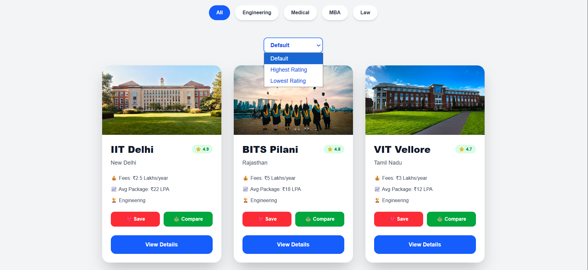
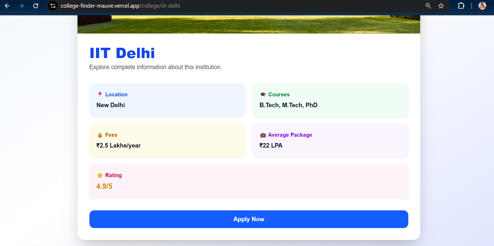
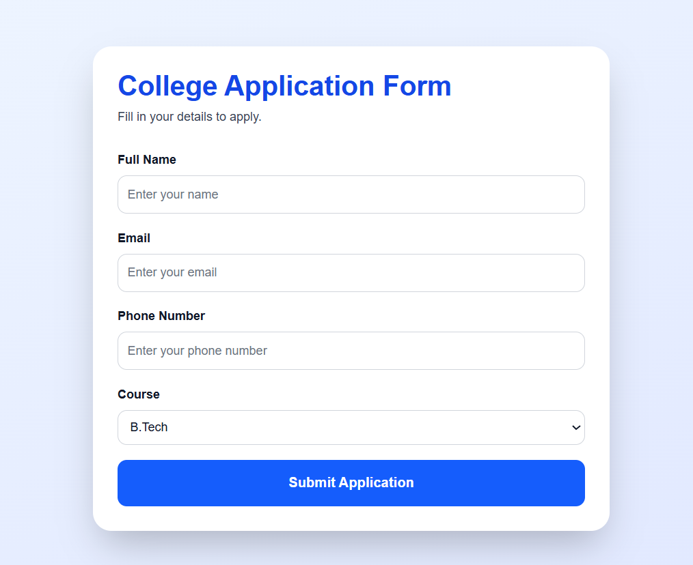

# 🎓 CollegeFinder


A modern College Discovery and Application Platform built using **Next.js**, **React**, **TypeScript**, **MongoDB**, and **Tailwind CSS**.

CollegeFinder helps students search, compare, save, and apply to colleges through a clean and user-friendly interface.

## 🌐 Live Demo

🔗 https://college-finder-mauve.vercel.app/

## 📌 Features

* 🔍 Search colleges by name or location
* 🏫 View detailed college information
* ❤️ Save favorite colleges
* ⚖️ Compare colleges side-by-side
* 📊 Sort colleges by rating
* 🎯 Filter colleges by category
* 📝 College application form
* 💾 Store applications in MongoDB
* 📱 Responsive design for all devices
* ⚡ Fast performance with Next.js

## 🛠️ Tech Stack

### Frontend

* Next.js 16
* React 19
* TypeScript
* Tailwind CSS

### Backend

* Next.js API Routes
* MongoDB Atlas

### Deployment

* Vercel

## 📂 Project Structure

```bash
college-platform/
│
├── src/
│   ├── app/
│   ├── components/
│   └── api/
│
├── lib/
│   └── mongodb.ts
│
├── screenshots/
│
├── public/
│
├── README.md
└── package.json
```

## 🔗 Repository

https://github.com/aryasinha23/College-Finder

## 🚀 Installation

Clone the repository:

```bash
git clone https://github.com/aryasinha23/College-Finder.git
```

Navigate to project folder:

```bash
cd College-Finder
```

Install dependencies:

```bash
npm install
```

Create a `.env.local` file:

```env
MONGODB_URI=your_mongodb_connection_string
```

Run development server:

```bash
npm run dev
```

Open:

```text
http://localhost:3000
```

## 📸 Screenshots

### Home Page



### College Listings



### College Details



### Application Form



## 🗄️ Database

MongoDB Atlas is used to store:

* Student applications
* User-submitted data
* Future college management data

## 🔐 Environment Variables

Create a `.env.local` file:

```env
MONGODB_URI=your_mongodb_connection_string
```

## 🎯 Future Improvements

* User Authentication
* Admin Dashboard
* AI College Recommendations
* Advanced Filters
* Email Notifications
* Application Tracking

## 🤝 Contributing

Contributions are welcome.

1. Fork the repository
2. Create a new branch
3. Make your changes
4. Submit a Pull Request

## 👨‍💻 Author

Arya Sinha

GitHub: https://github.com/aryasinha23

## ⭐ Support

If you like this project, please give it a star on GitHub.

---

Made with ❤️ using Next.js and MongoDB.
